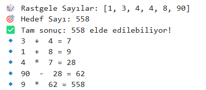
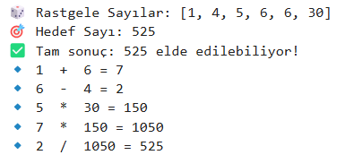
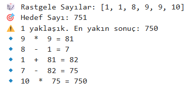
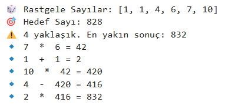
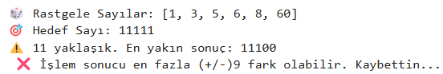

# one-word-and-one-operation-TV-competition-program-only-operation-section
One word and one operation TV competition program: only operation section

Bir kelime bir işlem tv yarışma programının sadedece işlem bölümünün bir simülasyonudur.
## Soruna Yaklaşım
### Görev: 
5 adet tek basamaklı sayı ve 1 adet çift basamaklı sayıyı dört işlem marifetiyle 3 basamaklı bir sayıyı veya ona en yakın değeri bulma. En yakın sayı (+/-) 9 olabilir.
### Kurallar
- Tüm sayılar random üretilecek.
- Bulunacak sayı için tüm rakamları kullanmaya gerek yok.
- Random üretilen sayılar tekar edebilir.
- Çift basamaklı sayı 10'un katları olmalı.

## Çözüm Mantığı
Kullanılan dil: Python
### Random sayı üretme
5 adet tek basamaklı tekrar edebilir sayı üretimi için random.choices(range(1, 10), k=5) kullanıldı.
Çift basamaklı ve 10'un katları olması gereken gereken sayı için ise (1-9) arası random sayı üretilip 10 ile çarpıldı.
Hedef sayı ise random (100-999) arası üretildi.

### Kullanılan kütüphaneler
- random
- combinations
  
### Fonksiyonlar
- Dört işlem fonsiyonu (**apply_operations**)
- Hedefi bulma fonksiyonu (Backtracking ile hedefi bulma) (**find_target**)

### Process:
Her soru sorulduğunda toplamda elimizde 6 adet sayı olacak ve bu sayılar ikişerli olarak dört işleme girecekler. **a [op] b = result**
[op] = toplama, çarpma, çıkarma ve bölme
Toplama ve çarpmada a ve b nin yerleri önemli değilken çıkarmada a - b ve b - a olmak üzere iki sonuç alınacaktır.
Bölme işlemi için 0'a bölünme hatası (zero divition error) kontolü yapılmalı. Bölüm sonucu tam sayı olmalı. (integer)
Dört işlem fonksiyonu sonucunda her seferinde bölme işlemi sonucuna göre 4 ile 5 arasında sayı results listesine eklenecektir.
6'nın 2'li kombinasyonu şeklinde tüm sayılar seçilmelidir.
Çıkan işlem sonucu tekrar işleme alınabilir olmadır. Bunun içinde yenilenen bir sayı listesine ihtiyacımız var. (**new_numbers**) Aynı zamanda kullanılan sayılar (**used_numbers**) ise tekrar işleme sokulmamalıdır.
Böylelikle hiç bir sonucu kaçırmamış oluruz. Her çıkan result değeri ile hedef sayı karşılaştırılır. Eğer tam eşleşme yoksa en yakın sonuç hafızada tutulur. (**closest_result**)
### Big-O Analizi ve Verimlilik
- Brute Force (Kaba Kuvvet): 𝑂(𝑛!×4^n)
- Backtracking + Pruning: O(2^n) (Kötü durum)
- Dynamic Programming ile Geliştirilmiş Backtracking: O(n^2)
Bu yüzden Backtracking + Pruning, en iyi çözüm yolu olacaktır!

### Backtracking ile hedefi bulma
Tam sonucun bulunması veya (+/-)9'a kadar yakın sonucun bulunması takdirinde işlem silsilesi yazdırılmalıdır. Bunun için adımları takip edebileceğimiz liste (**steps**) tutulur. her bir adımda (**step**) birinci sayı, işlem işareti, ikinci sayı ve sonuç tutulur (**{a,op,b,result}**). Doğru sonuç bulunduğunda steps listesi sırayla ekrana yazdırılır. Eğer tam sonuç bulunmuş ise döngü kesilir. Tam sonuç bunmadığı durumlarda işlem bir sonraki ikili sayı kombinasyonuna geçer.

### Çalışan kod dosyası
- [operation.py](operation.py)

##Çalışan Ekran Görüntüsü

- 
- 
- 
- 
- 
